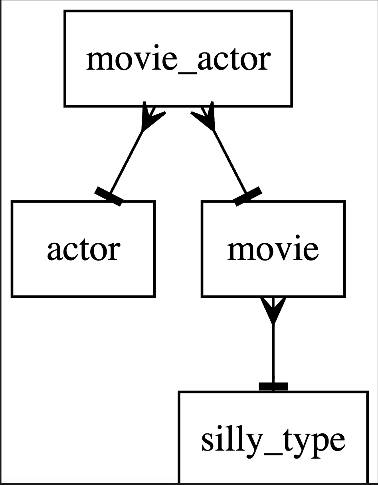

# 3NF - Entity Relationship Modeller in Third Normal Form

3nf is a modeling language and compiler for data models.
A data model is expressed in the 3nf language.
When it is compiled by the 3nf compiler the following artifacts are generated:
* `gen.sql`: a sequel script that generates the database in PostgreSQL
* `<schema name>.dot`: an ER diagram that can be visualised with [GraphViz](https://graphviz.org)

3nf is open source under the (UNLICENSE)[https://unlicense.org]

# Example: Silly
See [silly.md](examples/silly/silly.md) for a silly example.

The source code file is a markdown (.md) file.

All text inside code blocks (delimeted by ```) will be treated as 3nf model input by the 3nf compiler.

All text outside code blocks will be treated as documentation and ignored by the 3nf compiler.

The data model specification in `silly.md` follows:

```
schema silly
```
The schema is identified as `silly`. This will be used as the schema name in SQL code

```
enum silly_type {
    "Funny" = 1;
    "Strange" = 2;
    "Dangerous" = 3;
}
```
`silly_type` is an enumeration. It will be implemented as a populated table in [gen.sql](examples/silly/sql/gen.sql).

```
actor {
    id serial PK
    name text not null
}
```
`actor`, `movie` and `movie_actor` specify entities which are generated as tables in 
[gen.sql](examples/silly/sql/gen.sql).
```
movie {
    id serial PK
    name text not null
    silly int FK silly_type.id not null
}
```
movie has many to 1 relation with `silly_type` through the field, `silly` which is a foreign key into `silly_type`.
Field `silly` is mandatory.
```

movie_actor {
    id serial PK
    actor int FK actor.id not null
    movie int FK movie.id not null
}
```
`movie_actor` implements the many-many relationship between `actor` and `movie`.

## Running the 3nf compiler

`3nf <path to example><example>.md`

For example:

If your current directory is the root of 3nf:

`3nf examples/silly/silly.md`

## Generated SQL 

When `silly.md` is compiled with `3nf` it generates the [gen.sql](examples/silly/sql/gen.sql) file:

```
CREATE SCHEMA IF NOT EXISTS "silly";


CREATE TABLE IF NOT EXISTS "silly"."silly_type"
(
	id bigint,
	name text UNIQUE NOT NULL,
	description text NULL,
	Primary Key (id)
); 
INSERT INTO "silly"."silly_type" VALUES (1,'Funny','');
INSERT INTO "silly"."silly_type" VALUES (2,'Strange','');
INSERT INTO "silly"."silly_type" VALUES (3,'Dangerous','');


CREATE TABLE IF NOT EXISTS "silly"."actor"
(
	"id" bigserial,
	"name" text NOT NULL,
	PRIMARY KEY ("id")
); 


CREATE TABLE IF NOT EXISTS "silly"."movie"
(
	"id" bigserial,
	"name" text NOT NULL,
	"silly" bigint NOT NULL,
	PRIMARY KEY ("id"),
	FOREIGN KEY ("silly") REFERENCES "silly"."silly_type" ("id") 
); 


CREATE TABLE IF NOT EXISTS "silly"."movie_actor"
(
	"id" bigserial,
	"actor" bigint NOT NULL,
	"movie" bigint NOT NULL,
	PRIMARY KEY ("id"),
	FOREIGN KEY ("actor") REFERENCES "silly"."actor" ("id"), 
	FOREIGN KEY ("movie") REFERENCES "silly"."movie" ("id") 
); 


```

## Generated GraphViz ERM diagram

3nf also generates a Graphviz diagram containing an ERM diagram[silly.dot](examples/silly/dot/silly.dot):



# Installation

## Prerequisites
You need a [Go installation](https://go.dev/)

## Installing 3nf

`go install github.com/goccmack/3nf`